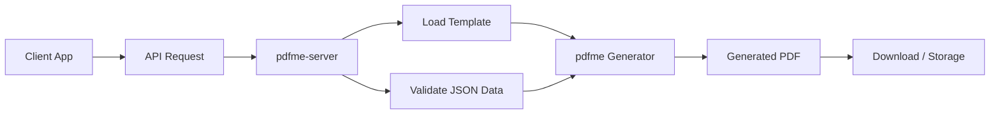

<div align="center">

# pdfme-server

**A self-hosted server and dashboard for generating PDFs with pdfme templates.**

Build, manage, and generate PDFs from reusable templates using a simple API and dashboard powered by [pdfme](https://github.com/pdfme/pdfme).

<br />

[](./LICENSE)
[](https://github.com/pdfme/pdfme)
[](https://nodejs.org/)
[](#self-hosting)

<br />

<a href="#features">Features</a>
· <a href="#getting-started">Getting Started</a>
· <a href="#api">API</a>
· <a href="#roadmap">Roadmap</a>
· <a href="#disclaimer">Disclaimer</a>

</div>

---

## Overview

**pdfme-server** is an independent self-hosted server and dashboard for generating PDFs with [pdfme](https://github.com/pdfme/pdfme) templates.

The goal is to make it easy to:

* Manage PDF templates from a web dashboard.
* Generate PDFs through an HTTP API.
* Organize templates by users or workspaces.
* Use pdfme without building a full backend from scratch.
* Self-host your own PDF generation service.

> This project is built on top of **pdfme**, a TypeScript-based PDF generation library.

---

## Features

* PDF generation using pdfme templates.
* Template management.
* REST API for PDF generation.
* Dashboard for managing templates.
* User authentication.
* API key support.
* Self-hosted deployment.
* Simple JSON-based PDF generation.
* Designed for developers and small teams.

---

## Why pdfme-server?

[pdfme](https://github.com/pdfme/pdfme) is a powerful library for creating and generating PDFs with templates.

However, many projects need more than a library:

| Need                      | What pdfme-server adds      |
| ------------------------- | --------------------------- |
| Generate PDFs from an API | HTTP endpoints              |
| Store templates           | Template management         |
| Protect access            | Authentication and API keys |
| Use it as a service       | Self-hosted server          |
| Manage PDFs visually      | Dashboard                   |
| Use in internal tools     | Simple integration layer    |

---

## Built with

* [pdfme](https://github.com/pdfme/pdfme) — PDF generation and template engine.
* [Node.js](https://nodejs.org/) — JavaScript runtime.
* [TypeScript](https://www.typescriptlang.org/) — Typed JavaScript.
* [React](https://react.dev/) — User interface.
* [Next.js](https://nextjs.org/) — Full-stack web framework.

> The stack may change as the project evolves.

---

## Example Use Case

You can use **pdfme-server** to generate:

* Invoices
* Certificates
* Contracts
* Reports
* Receipts
* Delivery notes
* Internal documents
* Customer-facing PDFs

---

## How it works



---

## Getting Started

> This project is currently in early development.

### 1. Clone the repository

```bash
git clone https://github.com/YOUR_USERNAME/pdfme-server.git
cd pdfme-server
```

### 2. Install dependencies

```bash
npm install
```

### 3. Configure environment variables

Create a `.env` file:

```env
DATABASE_URL="your_database_url"
JWT_SECRET="your_jwt_secret"
API_KEY_SECRET="your_api_key_secret"
STORAGE_PROVIDER="local"
```

### 4. Run the development server

```bash
npm run dev
```

The app should be available at:

```txt
http://localhost:3000
```

---

## API

### Generate a PDF

```http
POST /api/v1/generate
Authorization: Bearer YOUR_API_KEY
Content-Type: application/json
```

### Request body

```json
{
  "templateId": "invoice-template",
  "data": {
    "customerName": "John Doe",
    "invoiceNumber": "INV-001",
    "total": "$120.00"
  }
}
```

### Response

```json
{
  "success": true,
  "fileName": "invoice-template-INV-001.pdf",
  "downloadUrl": "https://example.com/generated/invoice-template-INV-001.pdf"
}
```

---

## Example with cURL

```bash
curl -X POST http://localhost:3000/api/v1/generate \
  -H "Authorization: Bearer YOUR_API_KEY" \
  -H "Content-Type: application/json" \
  -d '{
    "templateId": "invoice-template",
    "data": {
      "customerName": "John Doe",
      "invoiceNumber": "INV-001",
      "total": "$120.00"
    }
  }'
```

---

## Project Structure

```txt
pdfme-server/
├── apps/
│   ├── web/
│   └── api/
├── packages/
│   ├── pdf-generator/
│   ├── database/
│   └── shared/
├── public/
├── docs/
├── README.md
├── LICENSE
└── package.json
```

---

## Self Hosting

The goal of this project is to be easy to self-host.

Possible deployment targets:

* VPS
* Docker
* Railway
* Render
* Fly.io
* Vercel
* Coolify
* AWS
* DigitalOcean

---

## Docker

> Docker support is planned.

```bash
docker compose up -d
```

Example `docker-compose.yml`:

```yaml
services:
  pdfme-server:
    image: pdfme-server:latest
    ports:
      - "3000:3000"
    env_file:
      - .env
```

---

## Environment Variables

| Variable           | Description                         | Required |
| ------------------ | ----------------------------------- | -------- |
| `DATABASE_URL`     | Database connection URL             | Yes      |
| `JWT_SECRET`       | Secret used for authentication      | Yes      |
| `API_KEY_SECRET`   | Secret used to hash API keys        | Yes      |
| `STORAGE_PROVIDER` | Storage driver: `local`, `s3`, etc. | No       |
| `PORT`             | Server port                         | No       |

---

## Roadmap

* [ ] Basic PDF generation endpoint
* [ ] Template upload
* [ ] Template preview
* [ ] User authentication
* [ ] API key management
* [ ] Dashboard UI
* [ ] Workspace support
* [ ] Role-based access control
* [ ] PDF history
* [ ] Local file storage
* [ ] S3-compatible storage
* [ ] Docker support
* [ ] Webhooks
* [ ] Public API documentation

---

## Screenshots

> Screenshots will be added later.

<div align="center">

| Dashboard   | Template Editor |
| ----------- | --------------- |
| Coming soon | Coming soon     |

</div>

---

## Related Projects

* [pdfme](https://github.com/pdfme/pdfme) — TypeScript-based PDF generation library.
* [pdfme documentation](https://pdfme.com/docs) — Official pdfme documentation.
* [pdfme website](https://pdfme.com/) — Official pdfme website.

---

## Disclaimer

**pdfme-server** is an independent community project built on top of [pdfme](https://github.com/pdfme/pdfme).

This project is **not affiliated with, endorsed by, sponsored by, or officially maintained by the pdfme team**.

The name **pdfme** belongs to its respective owners.

This project only uses pdfme as an open-source dependency.

---

## License

This project is licensed under the [MIT License](./LICENSE).

pdfme is also released under the MIT License. See the original project here:

* [pdfme GitHub repository](https://github.com/pdfme/pdfme)

---

## Author

Created and maintained by **YOUR_NAME**.

* GitHub: [@YOUR_USERNAME](https://github.com/YOUR_USERNAME)

---

<div align="center">

Made with ❤️ using [pdfme](https://github.com/pdfme/pdfme)

</div>
