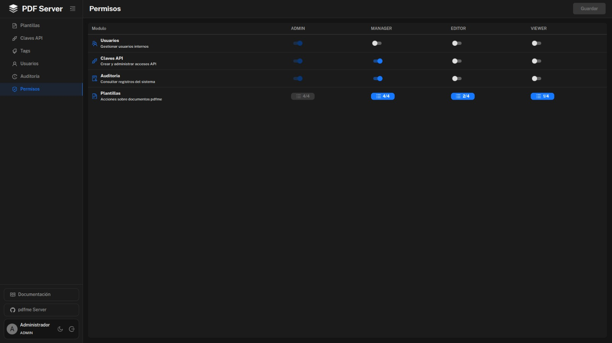
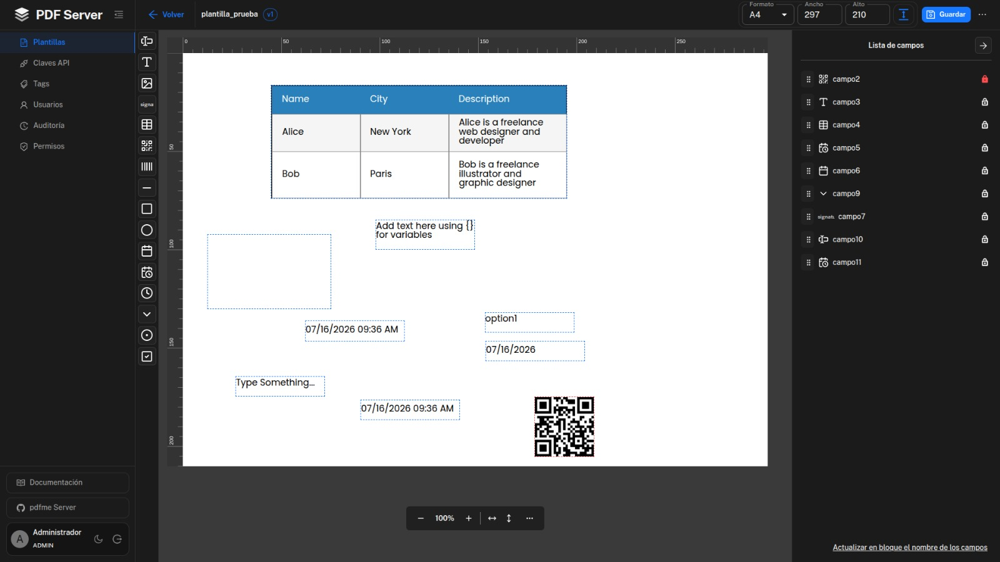

<div align="center">

# pdfme-server

**Plataforma para administrar plantillas pdfme y exponer una API protegida para integraciones externas.**

[](https://github.com/pdfme/pdfme)
[](https://www.prisma.io/)

</div>

---

## Objetivo

`pdfme-server` es un monorepo con frontend y backend en un solo repositorio. La app permite administrar plantillas PDF, controlar usuarios/permisos, crear API keys y exponer endpoints para que sistemas externos consulten plantillas y soliciten generación de documentos.

La documentación funcional para integradores vive dentro del frontend autenticado en:

```txt
/documentation/{ruta}
```

---

## Vista de la aplicación

Gestión de permisos por rol:



Creación y configuración de plantillas:



---

## Estructura

```txt
pdfme-server/
├── backend/          # API + Prisma + PostgreSQL
├── frontend/         # React/Vite + MUI + pdfme UI
├── .env.example      # Variables base para frontend y backend
├── INSTALL.md        # Instalación local y despliegue por Dockerfiles separados
├── package.json      # Metadatos raíz del monorepo
└── README.md
```

---

## Servicios

| Servicio | Ruta | Puerto local | Descripción |
| --- | --- | --- | --- |
| Frontend | `frontend/` | `5173` | Aplicación web, editor, vista previa, usuarios, permisos y documentación. |
| Backend | `backend/` | `4000` | API, autenticación, sesiones, plantillas, API keys y endpoints externos. |
| PostgreSQL | Externo/local | Según instalación | Base de datos usada por Prisma. |

URLs locales habituales:

```txt
Frontend:      http://localhost:5173
Backend API:   http://localhost:4000/api
Health check:  http://localhost:4000/api/health
Documentación: http://localhost:5173/documentation/getting-started
```

En desarrollo, el frontend usa `VITE_BACKEND_API_URL` para apuntar al backend. El valor local recomendado es `http://localhost:4000`. No agregues `/api`; las rutas internas de la app ya lo incluyen.

---

## Stack

| Área | Tecnología |
| --- | --- |
| Frontend | Aplicación web con MUI y documentación integrada |
| Documentación interna | React Markdown + Remark GFM dentro del frontend |
| Tablas | TanStack Table / Grid.js según módulo |
| Backend | API HTTP sobre Node.js |
| Base de datos | PostgreSQL |
| ORM | Prisma |
| PDF | pdfme |
| Sesión | Cookie HTTP + almacenamiento en base de datos |
| API externa | Header `x-api-key` con clave hasheada |

---

## Requisitos

- Node.js `>=18.20.8`.
- PostgreSQL accesible desde el backend.
- npm.

---

## Variables de entorno

Puedes usar el archivo raíz como referencia general:

```bash
cp .env.example .env
```

Para desarrollo por carpetas, normalmente se crea cada archivo según el servicio:

```bash
cp backend/.env.example backend/.env
cp frontend/.env.example frontend/.env
```

Variables principales:

Backend - API HTTP:

| Variable | Descripción |
| --- | --- |
| `DATABASE_URL` | Conexión PostgreSQL usada por Prisma. |
| `API_PORT` | Puerto HTTP del backend. Por defecto `4000`. |
| `WEB_APP_URL` | URL principal del frontend permitida para cookies/CORS. |
| `CORS_ALLOWED_ORIGINS` | Lista separada por comas de orígenes adicionales permitidos. |

Backend - usuario administrador inicial para seed/bootstrap:

| Variable | Descripción |
| --- | --- |
| `INITIAL_ADMIN_EMAIL` | Email del administrador inicial cuando aún no existe ningún usuario en la base de datos. |
| `INITIAL_ADMIN_PASSWORD` | Contraseña del administrador inicial para el seed/bootstrap. |

Backend - autenticación y claves externas:

| Variable | Descripción |
| --- | --- |
| `AUTH_SECRET` | Secreto largo para firmar tokens de sesión. |
| `AUTH_COOKIE_NAME` | Nombre de cookie de sesión. |
| `AUTH_COOKIE_MAX_AGE_SECONDS` | Duración de la cookie de sesión en segundos. |
| `API_KEY_SECRET` | Secreto largo para hashear API keys externas. |

Frontend - build y conexión con backend:

| Variable | Descripción |
| --- | --- |
| `VITE_APP_NAME` | Nombre visible de la aplicación usado en el logo y en el título de la pestaña. |
| `VITE_BACKEND_API_URL` | Base URL del backend que consume el frontend. En local: `http://localhost:4000`. En despliegue con un solo dominio puede quedar vacia para usar `/api` relativo. |

---

## Instalación

Guía completa: [INSTALL.md](./INSTALL.md).

Backend:

```bash
cd backend
npm install
npm run prisma:generate
npm run prisma:push
npm run prisma:seed
npm run dev
```

Frontend:

```bash
cd frontend
npm install
npm run dev
```

---

## Scripts

Backend:

| Comando | Uso |
| --- | --- |
| `npm run dev` | Ejecuta el backend en desarrollo. |
| `npm run dev:watch` | Ejecuta backend con watch. |
| `npm run build` | Compila TypeScript a `dist/`. |
| `npm run start` | Ejecuta `dist/server.js`. |
| `npm run check` | Valida TypeScript sin emitir archivos. |
| `npm run prisma:generate` | Genera Prisma Client. |
| `npm run prisma:push` | Sincroniza schema con base de datos. |
| `npm run prisma:migrate` | Crea/aplica migración de desarrollo. |
| `npm run prisma:seed` | Crea datos iniciales. |

Frontend:

| Comando | Uso |
| --- | --- |
| `npm run dev` | Levanta Vite en `5173`. |
| `npm run build` | Compila TypeScript y genera `dist/`. |
| `npm run preview` | Sirve el build de producción localmente. |
| `npm run check` | Valida TypeScript sin emitir archivos. |

---

## Endpoints principales

Autenticación interna por sesión:

```http
POST /api/auth/login
POST /api/auth/logout
GET  /api/auth/me
```

Administración interna:

```http
GET    /api/templates
POST   /api/templates
PATCH  /api/templates/:id/page-settings
DELETE /api/templates/:id

GET    /api/tags
POST   /api/tags

GET    /api/api-credentials
POST   /api/api-credentials
PATCH  /api/api-credentials/:id/revoke

GET    /api/users
GET    /api/permissions
GET    /api/audit-logs
```

API externa con `x-api-key`:

```http
GET  /api/v1/templates
POST /api/v1/render
```

Estado del backend:

```http
GET /api/health
```

---

## Documentación para integradores

La documentación integrada está protegida por sesión y enfocada en consumo externo de API:

```txt
/documentation/getting-started
/documentation/authentication
/documentation/templates
/documentation/api
/documentation/responses
```

Contenido cubierto:

- URLs locales y producción para consumir la API.
- Cómo obtener una API key desde la app con permiso `api_keys.manage`.
- Uso de `templateCode` como contrato externo.
- Formato del payload `input`.
- Ejemplos `curl` y TypeScript.
- Respuestas, códigos HTTP, logging seguro y reintentos.

---

## Estado del render externo

El endpoint `POST /api/v1/render` ya valida API key y recibe el payload. Actualmente responde `501` hasta conectar la generación final con pdfme sobre la versión actual de la plantilla.

---

## Modelo de datos

Núcleo de plantillas:

```txt
template -> template_version -> template_page
```

Reglas principales:

- `template` representa la entidad de negocio.
- `template_version` guarda una versión completa de la plantilla.
- `template_page` guarda diseño y configuración de página.
- `template_version.is_current` define la versión vigente.
- Los PDFs generados no se almacenan por defecto.
- La generación se solicita bajo demanda por API.

---

## Librerías y referencias

Tecnologías principales y referencias visuales usadas en la aplicación:

[](https://github.com/pdfme/pdfme)
[](https://github.com/mui/material-ui)
[](https://github.com/codedthemes/mantis-free-react-admin-template)
[](https://github.com/facebook/react)
[](https://github.com/vitejs/vite)
[](https://github.com/TanStack)
[](https://github.com/grid-js/gridjs)
[](https://github.com/remarkjs/react-markdown)
[](https://github.com/Grsmto/simplebar)
[](https://github.com/ant-design/ant-design-icons)
[](https://github.com/lucide-icons/lucide)
[](https://github.com/sweetalert2/sweetalert2)
[](https://github.com/prisma/prisma)
